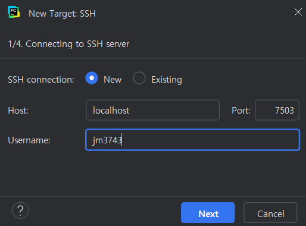
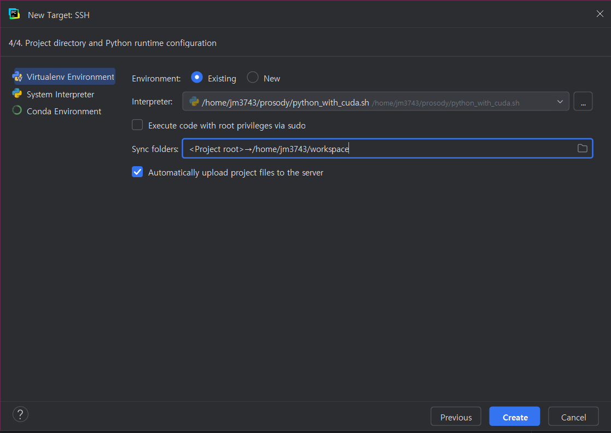

# gu-cli-remote-dev

Setting up remote development environment on Georgetown University's HPC GPU cluster.

Before you follow this walkthrough, please set up your cluster access and install an IDE of your choice.
This guide uses PyCharm.

Throughout the guide, I present general code, as well as how that code looks on my environment.
For example:
```angular2html
source /path/to/virtual/env/bin/activate
# source ~/jupyter-venv/bin/activate
```

Hope this helps! Feel free to cross-reference the
[HPC Documentation](https://hpc.georgetown.edu/how-to-run-jobs-slurm/how-to-use-gpu-resources).


## Connection sanity check

First, we want to log on to the GCP console and check the cluster's hostname and external IP address.
From the GCP dashboard, click _go to compute engine_ and you'll see the hostname under `Name` and
external IP under `External IP`.

You can also connect to the ssh and enter from the command line:
```
gcloud compute instances list
```
which will give you the same information.

Once you have the IP address, ping from your terminal or PowerShell to see if a connection can be made:
```
ping xxx.xx.xx.
# ping 83.52.196.75
```
. If you see lines like:

```
64 bytes from 83.52.196.75: icmp_seq=1 ttl=55 time=39.3 ms
64 bytes from 83.52.196.75: icmp_seq=9 ttl=55 time=37.3 ms
```

Success! We can `ctrl+c` out of there and proceed.

## Setting up SSH connection to login node

To set up remote development, we need to set up an SSH connection between your local machine,
and the login node (this is specific to GU HPC clusters--each server can have slightly different setup).
If you already set up connection with `gcloud init` as recommended by HPC documentation, you're in luck!
Skip to the next step.
We can use the `google_compute_engine` key, likely at `~/.ssh`.

Otherwise, let's first create an ssh key:
```
ssh-keygen -t rsa -b 4096 -C your_email@georgetown.edu
# ssh-keygen -t rsa -b 4096 -C jim335@georgetown.edu
```

That will create a public and private key at `~/.ssh`.
There is a 
```
ssh-copy-id username@server-address
ssh-copy-id jim335@83.52.196.75
```
command that can copy your key to the remote server,
but that didn't work for me.

So, we'll do that manually.

Let's print out the public key from your local machine:
```
cat /path/to/your/public/key.pub
# cat ~/.ssh/id_rsa.pub
```
We manually copy the public key, and on the remote server (accessible by web or gcloud sdk),

```angular2html
echo "public-key-text-here" >> /path/to/ssh/keys/authorized_keys
chmod 600 /path/to/ssh/keys/authorized_keys

# echo "ssh-rsa AAABLKDSAJEweifwlfk23489534gkklsdasdhf238942908 MY-PC\junghyun@MY-PC" >> ~/.ssh/authorized_keys
# chmod 600 ~/.ssh/authorized_keys
```

Then, from where the local key `rsa_id` is stored, we can SSH into the login node:
```
ssh -i your-private-key username@remote_server
# ssh -i ~/.ssh/id_rsa jim335@83.52.196.75
```

Great! We're in the login node.
But be wary--our HPC program manager [Woonki](mailto:chung@georgetown.edu)
asks us to be carefuly and not run jobs on the login node.
Where do we run things instead? On the compute node!

## Creating a compute node and an SSH tunnel to it

From the login node, we want to create a compute node. Because right now, we are just testing out the connection,
let's forgo the GPU for now, and run 
```
srun --pty bash
```
If we were to ask for a compute node with a GPU,
we can simply add `--gres=gpu` to make `srun --gres=gpu --pty bash`.

It's not possible to SSH directly into the compute node because the compute node has no external IP address.
So, we'll have to create an SSH tunnel via port forwarding.

Find the compute node's hostname with `hostname` or by checking the compute engine dashboard on GCP web,
then set up tunneling.

Pick your favorite 4- or 5-digit number to serve as your own port. Mine is `7503`.
Then, From the local machine:
```angular2html
ssh -i your-private-key -L your-fav-port:compute-node-hostname:22 username@login-node-address
# ssh -i ~/.ssh/id_rsa -L 7503:purple-base-cli-0
```

This will simply take you to the login node.
In a separate terminal on the local machine, try ssh-ing into the compute note with:

```angular2html
ssh -p your-port -i your-private-key username@localhost
# ssh -p 7503 -i ~/.ssh/id_rsa -L jim335@localhost
```

If this works, it means your local port 7503 is successfully mapped to the remote compute node!


Cool sart!

## Virtual environment setup

Ok, so far, we have:
1. Set up an SSH connection to the login node
2. Set up a tunnel to the compute node

Now, before we configure a remote Python console on PyCharm,
let's create a virtual environment, one we will use for our PyCharm console.
With commands like
```angular2html
python -V
nvcc --version
nvidia-smi
```
We can check Python and CUDA versions.

My cluster's default envrionment (Python3.6) supports
neither recent `torch` versions nor PyCharm's remote interpreter console!

So, we want to create a virtual environment that PyCharm can use.
We can start from picking the right modules.

With `module avail` we can see what modules are available.
```angular2html
module avail anaconda3
module avail cuda
```
It turns out `anaconda3/3.11` and `cuda/12.5` are available in the remote cluster, so let's activate them:

```
module load anaconda3/3.11
module load cuda/12.5
```

From here, let's finally create and activate the virtual environment:
```
python -m venv /path/to/virtual/environment
source /path/to/virtual/environment/bin/activate

# python -m venv ~/prosody
# source ~/prosody/bin/activate
```

Now, you can set up your environment if you have a `requirements.txt` or `setup.py`.

One more thing before we configure the remote interpreter!
Before we created the virtual environment, we loaded the `cuda/12.5` module.
Pycharm would need to do the same, but it doesn't have explicit access to the module command.

However, we can implement a small workaround. With `vim` or any other text editor:
```angular2html
vim /path/to/virtual/environment/cool-bash-script.sh
# vim ~/prosody/python-with-cuda.sh
```

The following content ensures that the base interpreter is called after loading the CUDA 12.5 module.
```angular2html
#!/bin/bash
module load cuda/12.5
exec /path/to/virtual/env/bin/python3 "$@"
# exec ~/prosody/bin/python3 "$@"
```
You can skip this step if you did not load any modules.

## Remote interpreter, terminal, file sync configuration

Now onto PyCharm. We will configure three things:
1. The remote interpreter
2. Remote-local file sync (if you want)
3. The remote terminal

To set up the remote interpreter, you can click on the Python button on the bottom right corner > add new interpreter
Or, File > Settings > Project (project name) > Python interpreter

Click on Add interpreter > On SSH.
Enter your hostname (localhost), port (`7503` for me), and username.


Then, when prompted, provide your private SSH key.

Then, specify your existing interpreter.
For me it's the bash file `~/prosody/python-with-cuda.sh`.
If you didn't write a bash file referring to a necessary module, it would simply be
`/path/to/your/environment/bin/python3`. For me, it's `~/prosody/bin/python3`


Then, set your sync folder destination.
You will be able to choose to sync your local files to this directory.
It would be a smart idea to create a project-specific work directory and use that.
I simply put `~/workspace` as an example.

The, click on Create and boom! You configured your remote interpreter and file sync.

Now that we've established console and file sync, setting up terminal should be easy.

Click on the terminal button on the lower left hand side corner.
Your current tab should be `Local`, but click on the downward arrow next to it,
and you should be able to select the remote terminal that looks like `username@localhost:port #jim335@localhost:7503`

Congratulations! Now your local files are also on the remote server,
and your PyCharm's interpreter uses the remote compute.
You are able to develop interactively on the same environment as to where you would submit jobs.

## Test code, notebook, and debug
PyCharm supports .ipynb support, and allows for easy run and debugging environments.

It's like ptb.set_trace()...but easier!

But, if for a good reason you want to launch a notebook on the remote server and work on it on your local browser,
you can still do that via SSH tunneling.

First set up a remote virtual environment as you wish and install Jupyter: `pip install jupyter`

Then, simply launch with a specific IP and port:
```
jupyter notebook --no-browser --port=remote-port --ip=0.0.0.0
# jupyter notebook --no-browser --port=8888 --ip=0.0.0.0
```

Now, set up SSH tunneling:
```angular2html
ssh -i your-private-key -L local-port:compute-node-hostname:remote-port username@login-node-external-address
# ssh -i ~/.ssh/id_rsa -L 9999:purple-base-cli-0:8888 jim35@83.52.196.75
```

Then, go to `localhost:local-port # localhost:9999` on your browser.
It will ask you for the token, which you can copy from your compute node terminal.
Or, paste from your compute node into your browser 
```
localhost:local-port/tree?token=some-alphanumeric-token
# localhost:9999/tree?token=2q489f2iofj8fsdaklfj892q34j829rfujaskldfjkl
```

Voila!

## Some other reminders

Finally, I'd like to echo Woonki's messages:

1. Please do not run your jobs on the login node
Please use a Slurm interactive job or submit a Slurm batch job instead of running it directly on the login node.
2. There are examples of gcloud storage or gsutil job scripts as well for data transfer. 

https://hpc.georgetown.edu/how-to-run-jobs-slurm
https://hpc.georgetown.edu/how-to-transfer-files/transferring-data-from-or-to-gcs

2. Disk space

Could you please clean up and/or archive your inactive data?
If your application is producing a lot of cache/metadata, you should utilize `$SCRATCH` as shown in the Data Management. 

FYI, as noted at Data Management for `$HOME`:
It is not backed up.

This is for active data only. Please do not use this as a long term data storage.
You should remove inactive data from this.

It is strongly recommended that you clean up your data, e.g., removing metadata, old projects files, tar files, etc.,
frequently for other users. Also you should back up finished data to appropriate storage like GCS.

It is also recommended to utilize $SCRATCH below, if necessary.


3. Memory for your jobs

I see that you are submitting your job with a huge memory requirement.
I am not sure if it really requires that much memory per job.. If so, it is fine.
If not, it wastes resources for other users as well as yourself, blocking them.
Also it would cost you/PI substantially higher SUs.
If you are in the process of finding a proper max memory,
please refer to the "Finding more about Jobs" section of https://hpc.georgetown.edu/how-to-run-jobs-slurm.
For example, you can find the maximum memory (maxrss) used in the past jobs using the following command:

```angular2html
sacct -S2024-07-01 --format=jobid,jobname,elapsed,ncpus,ntasks,maxrss,state
```

Just in case, you can use `--mem` Slurm option for the total memory when submitting jobs,
instead of `--mem-per-cpu` which is the memory per task or CPU.
