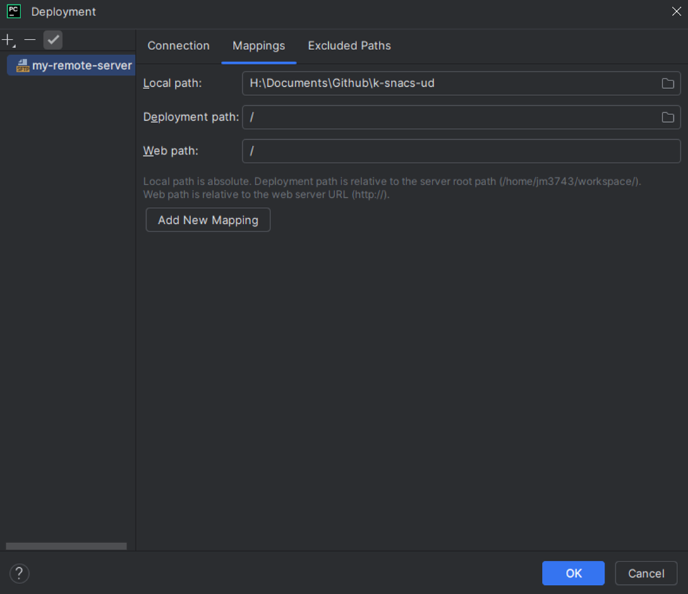

# gu-cli-remote-dev

Setting up remote development environment on Georgetown University's HPC GPU cluster.

Before you follow this walkthrough, please set up your cluster access and install an IDE of your choice. This guide uses PyCharm.

## Connection sanity check

First, we want to log on to the GCP console and check the cluster's hostname and external IP address.
From the GCP dashboard, click _go to compute engine_ and you'll see the hostname under `Name` and external IP under `External IP`.

You can also connect to the ssh and enter from the command line: `gcloud compute instances list` which will give you the same information.

Once you have the IP address, ping from your terminal or PowerShell to see if a connection can be made:
`ping xxx.xx.xx.xxx`. If you see lines like:

```
64 bytes from 34.74.129.118: icmp_seq=1 ttl=55 time=39.3 ms
64 bytes from 34.74.129.118: icmp_seq=9 ttl=55 time=37.3 ms
```

Success! We can `ctrl+c` out of there and proceed.

## Setting up SSH connection to login node

To set up remote development, we need to set up an SSH connection between your local machine, and the login node (this is specific to GU HPC clusters--each server can have slightly different setup).

Let's first create an ssh key: ```ssh-keygen -t rsa -b 4096 -C your_email@georgetown.edu```

That will create a public and private key at `~/.ssh`. There is a `ssh-copy-id username@server-address` command that can copy your key to the remote server, but that didn't work for me.

So, we'll do that manually.

Let's print out the public key from your local machine:
```
cd ~/.ssh
cat id_rsa.pub
```
We manually copy the public key, and on the remote server (accessible by web or gcloud sdk),

```angular2html
echo "public-key-text-here" >> ~/.ssh/authorized_keys
chmod 600 ~/.ssh/authorized_keys
```

Then, from where the local key `rsa_id` is stored, we can SSH into the login node:
`ssh -i rsa_id username@remote_server`

Great! We're in the login node. But be wary--our HPC program manager [Woonki](mailto:chung@georgetown.edu) asks us to be carefuly and not run jobs on the login node.
Where do we run things instead? On the compute node!

## Creating a compute node and an SSH tunnel to it

From the login node, we want to create a compute node. Because right now, we are just testing out the connection, let's forgo the GPU for now, and run
`srun --pty bash`. If we were to ask for a compute node with a GPU, we can simply add `--gres=gpu` to make `srun --gres=gpu --pty bash`.

It's not possible to SSH directly into the compute node because the compute node has no external IP address. So, we'll have to create an SSH tunnel via port forwarding.

Find the compute node's hostname with `hostname` or by checking the compute engine dashboard on GCP web, then set up tunneling.

Pick your favorite 4- or 5-digit number to serve as your own port. Mine is `7503`.
Then, From the local machine:
```angular2html
ssh -i id_rsa -L 7503:compute-node-hostname:22 username@login-node-address
```

This will simply take you to the login node. In a separate terminal on the local machine, try ssh-ing into the compute note with:

```angular2html
ssh -p 7503 -i id_rsa username@localhost
```

If this works, it means your local port 7503 is successfully mapped to the remote compute node!


Cool sart!

## Connect on PyCharm, set up file sync, Python interpreter, and terminal

### SSH on PyCharm
Now, we open PyCharm, and open a local project you'd like to develop remotely.
Go to File > Remote Development > SSH Connection, which gives us the following window:


Fill out the details, like your username, host (`localhost`) and location of the private key `id_rsa`.

This takes a bit. But now we're in!

### File sync
Now we want to set up file sync. To do this, we go to Tools > Deployment > Configuration.

Next, add connection, specify connection type to SFTP, and select the recently created SSH configuration. Crate your root path--I like to create a workspace in my remote home directory
`mkdir ~/workspace` and use that as my root directory.


We want our local project files to sync with our remote workspace, so we map the local path `/path/to/your/project` to the deployment path `/` (which corresponds to `~/workspace`)



Set automatic file upload and click upload now.

### Interpreter and terminal setup

We're almost done! We're working on the remote server, so we want to use the remote python interpreter as well. To do that, click on Python in the bottom right corner of your PyCharm window, then 
select add new interpreter > on SSH. We'll use the existing SSH connection, the one we just made now. Make sure your `Sync folders` is correct--PyCharm sets it to a random `/tmp` directory by default.


Terminal setup is easy--simply selet the remote SSH in the dropdown list of available terminals in the terminals tab, accessibly via the icon on the bottom left side of your PyCharm window.

## Test code, notebook, and debug
PyCharm supports .ipynb support, and allows for easy run and debugging environments.

It's like ptb.set_trace()...but easier!

## Some other reminders

Finally, I'd like to echo Woonki's messages:

1. Please do not run your jobs on the login node
Please use a Slurm interactive job or submit a Slurm batch job instead of running it directly on the login node. There are examples of gcloud storage or gsutil job scripts as well for data transfer. 

https://hpc.georgetown.edu/how-to-run-jobs-slurm
https://hpc.georgetown.edu/how-to-transfer-files/transferring-data-from-or-to-gcs

2. Disk space

Could you please clean up and/or archive your inactive data? If your application is producing a lot of cache/metadata, you should utilize `$SCRATCH` as shown in the Data Management. 

FYI, as noted at Data Management for `$HOME`:
It is not backed up.

This is for active data only. Please do not use this as a long term data storage. You should remove inactive data from this.

It is strongly recommended that you clean up your data, e.g., removing metadata, old projects files, tar files, etc., frequently for other users. Also you should back up finished data to appropriate storage like GCS.

It is also recommended to utilize $SCRATCH below, if necessary.


3. Memory for your jobs

I see that you are submitting your job with a huge memory requirement. I am not sure if it really requires that much memory per job.. If so, it is fine. If not, it wastes resources for other users as well as yourself, blocking them. Also it would cost you/PI substantially higher SUs. If you are in the process of finding a proper max memory, please refer to the "Finding more about Jobs" section of https://hpc.georgetown.edu/how-to-run-jobs-slurm. For example, you can find the maximum memory (maxrss) used in the past jobs using the following command:
```angular2html
sacct -S2024-07-01 --format=jobid,jobname,elapsed,ncpus,ntasks,maxrss,state
```


Just in case, you can use `--mem` Slurm option for the total memory when submitting jobs, instead of `--mem-per-cpu` which is the memory per task or CPU.
